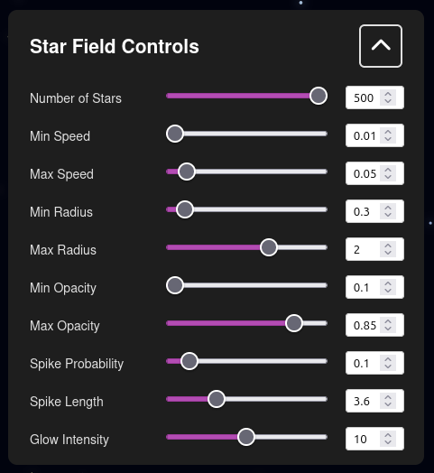

# StarFieldEffect


A simple and customizable star field effect created with Vue.js and HTML5 Canvas. This project provides components that generate animated stars with diffraction spikes (JWST-style) on a canvas element, with a control panel to adjust various parameters in real-time.

## Live demo

Try it out here: [https://imadsaddik.github.io/StarFieldEffect/](https://imadsaddik.github.io/StarFieldEffect/)

[Will be added soon.]

Watch my [YouTube tutorial](https://youtu.be/7tom-m31LTU) on how to create this effect.

## Features

This project allows you to do the following:

- Customize the number of stars in the field.
- Adjust star speed (minimum and maximum values).
- Control star size (radius minimum and maximum).
- Adjust star opacity/transparency levels.
- Control the probability of stars having diffraction spikes (JWST-style).
- Customize diffraction spike length and appearance.
- Adjust glow intensity around stars.

All of these parameters can be adjusted in real-time using the following [control panel](./src/components/ControlPanel.vue).



## Installation

This is a Vue.js project, so make sure that you have installed Vue. Here is a link to the [Vue.js documentation](https://vuejs.org/guide/quick-start.html) for more information.

Also make sure to install `pnpm` if you haven't already, as it is used to manage the dependencies in this project. Check out the [pnpm documentation](https://pnpm.io/installation) for installation instructions.

After you have installed Vue and pnpm, you can clone this repository:

```bash
git clone https://github.com/ImadSaddik/StarFieldEffect.git
cd StarFieldEffect
```

Then, install the dependencies:

```bash
pnpm install
```

Now you can run the development server:

```bash
pnpm run serve
```

You can now open your browser and navigate to `http://localhost:8080/StarFieldEffect/` to see the star field effect in action.

## Components

### StarWithDiffractionSpikes.vue

This component demonstrates a single star with diffraction spikes at the center of the screen. It's useful for testing and showcasing the star design with JWST-style diffraction spikes.

Use it this way in your `App.vue`:

```vue
<template>
  <StarWithDiffractionSpikes />
</template>

<script>
import StarWithDiffractionSpikes from "./components/StarWithDiffractionSpikes.vue";

export default {
  name: "App",
  components: {
    StarWithDiffractionSpikes,
  },
};
</script>
```

### StarBackground.vue

This is the main star field effect component. It generates multiple animated stars that move across the screen, creating a dynamic starfield background. This component works with `ControlPanel.vue` to allow real-time customization of the star field parameters.

Use it this way in your `App.vue`:

```vue
<template>
  <StarBackground :config="starConfig" />
  <ControlPanel :config="starConfig" @update:config="updateStarConfig" />
</template>

<script>
import StarBackground from "./components/StarBackground.vue";
import ControlPanel from "./components/ControlPanel.vue";

export default {
  name: "App",
  components: {
    StarBackground,
    ControlPanel,
  },
  data() {
    return {
      starConfig: {
        numStars: 120,
        speedMin: 0.05,
        speedMax: 0.2,
        radiusMin: 0.3,
        radiusMax: 1.5,
        alphaMin: 0.3,
        alphaMax: 0.8,
        spikeChance: 0.1,
        spikeLength: 3,
        glowIntensity: 8,
      },
    };
  },
  methods: {
    updateStarConfig(newConfig) {
      this.starConfig = { ...newConfig };
    },
  },
};
</script>
```

### ControlPanel.vue

This component provides an interactive control panel for adjusting star field parameters in real-time. It includes sliders and number inputs for all configurable properties like star count, speed, size, opacity, and diffraction spike settings.

## License

This project is licensed under the [MIT License](LICENSE).

## Contributions

We welcome contributions! If you find any issues or have suggestions for improvements, please open an issue or submit a pull request.

## Need help?

You can reach me through:  

- **LinkedIn** – [Connect with me](https://www.linkedin.com/in/imadsaddik/).  
- **Email** – [simad3647@gmail.com](mailto:simad3647@gmail.com).
